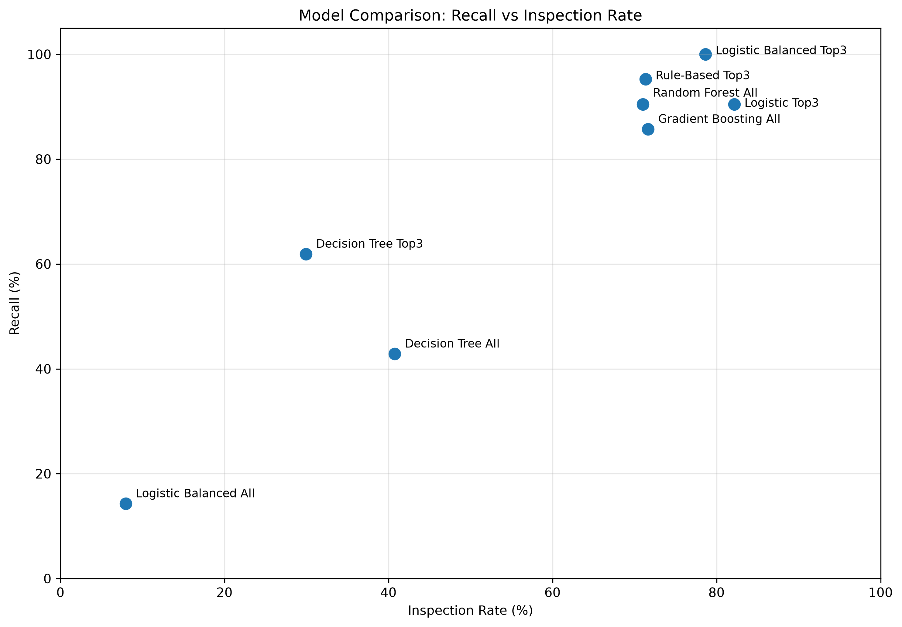

# 03. SECOM Manufacturing Quality Analysis

## 專案說明

本專案使用 UCI SECOM 半導體製程公開資料，進行製造業品質資料分析。

SECOM 資料包含大量匿名化製程特徵，以及每筆資料對應的 Pass / Fail 結果。原始資料共有 1,567 筆、590 個 Features，其中 Pass 1,463 筆、Fail 104 筆，Fail 約占 6.64%，資料有明顯的類別不平衡。

這次從前兩個專案的資料整理與描述性分析再往下延伸，加入統計分析、特徵篩選、Rule-Based 與 Machine Learning 模型。

分析目的不是直接取代品質檢查，而是先利用製程資料做風險篩選：

> **盡量找出 Fail，同時減少需要進一步檢查的產品數量。**

因此本專案將 **Recall ≥ 90%** 設為主要目標，再比較不同方法能將 **Inspection Rate** 降到多少。

---

## 資料來源

UCI Machine Learning Repository - SECOM

原始檔案：

* `secom.data`：製程特徵資料
* `secom_labels.data`：Pass / Fail 與時間資料
* `secom.names`：資料集說明

資料內容：

* 資料筆數：1,567
* 製程 Features：590
* Pass：1,463
* Fail：104
* Fail Rate：約 6.64%

由於 Features 都是匿名欄位，因此本專案只分析各 Feature 與 Pass / Fail 之間的差異及分類效果，不推測 Feature 實際代表的製程參數，也不做因果解讀。

---

## 專案目標

這次把問題設定成「風險篩選」。

假設原本所有產品都需要進一步檢查，希望先利用製程資料篩出高風險產品，在盡量不要漏掉 Fail 的情況下，減少需要檢查的產品比例。

主要目標：

> **Recall ≥ 90%，再盡可能降低 Inspection Rate。**

### Recall

Recall 代表實際的 Fail 中，有多少被成功找出來。

`Recall = TP / (TP + FN)`

例如 Test set 中有 21 個 Fail，成功找出其中 20 個：

`Recall = 20 / 21 = 95.24%`

所以 Recall 越高，代表漏掉的 Fail 越少。

### Inspection Rate

Inspection Rate 代表全部產品中，有多少被判定需要進一步檢查。

`Inspection Rate = (TP + FP) / Total Samples`

例如 100 個產品中有 70 個被標記需要檢查，Inspection Rate 就是 70%。

因此這次希望：

* Recall 維持在 90% 以上，盡量不要漏掉 Fail
* 在這個條件下，Inspection Rate 越低越好

兩個指標需要一起看。如果只追求高 Recall，很容易把大部分產品都送去檢查；如果只追求低 Inspection Rate，又可能漏掉太多 Fail。

另外，由於 Fail 只占全部資料約 6.64%，Accuracy 很容易受到大量 Pass 影響，因此不把 Accuracy 當成主要的模型選擇標準。

---

## 分析流程

### 1. 資料品質檢查
先檢查：
* 資料筆數與 Feature 數量
* Pass / Fail 分布
* 缺失值
* 沒有變化的 Features

原始 590 個 Features 中，有 116 個 Feature 的有效數值只有一種，沒有可用的變化資訊，因此在需要進行特徵篩選的分析中先移除。

缺失值則依後續分析方式處理，Machine Learning 模型以 Train data 的 median 進行填補，避免使用 Test data 的資訊。

### 2. 單變量統計分析

先分別觀察每一個 Feature，比較 Pass / Fail 的差異。

因為各 Feature 的數值尺度不同，因此使用 Cohen's d 將差異標準化，主要計算：

* Pass / Fail Mean
* Pass / Fail Standard Deviation
* Pooled Standard Deviation
* Cohen's d

Cohen's d 主要用來找出 Pass / Fail 差異較明顯的候選 Features。

正式 Train data 中以 `|Cohen's d| >= 0.5` 篩選後，得到：

* Feature 59
* Feature 103
* Feature 510

這些 Features 只代表在目前資料中 Pass / Fail 的分布差異較明顯，不代表它們是造成 Fail 的原因。

### 3. Rule-Based Screening

先使用統計分析找出的候選 Features 建立人工篩選規則。

Rule-Based 的做法分成兩個階段：

1. 先使用 Feature 510 作為 Gatekeeper，盡量攔下 Fail
2. 再利用其他候選 Features 排除部分誤抓的 Pass

目標一樣是在 Recall 維持 90% 以上的情況下，盡量降低 Inspection Rate。

正式版本使用 80 / 20 Train / Test split，缺失值處理、Cohen's d 特徵篩選及規則門檻都使用 Train data 建立，最後再套用到 Test set。

### 4. Machine Learning

接著建立不同 Machine Learning 分類模型，與 Rule-Based 方法比較：

* Logistic Regression
* Logistic Regression + Class Weight
* Decision Tree
* Random Forest
* Gradient Boosting

模型主要比較 Recall 與 Inspection Rate。

在模型與 threshold 調整上，依不同模型使用 Train、Validation 或 OOB（Out-of-Bag）資料進行調整，Test set 則留到最後評估。

---

## 使用技術

* Python
* Pandas
* NumPy
* Matplotlib
* Scikit-learn
* Cohen's d
* Logistic Regression
* Decision Tree
* Random Forest
* Gradient Boosting
* Train / Test Split
* Train / Validation / Test Split
* OOB（Out-of-Bag）
* Probability Threshold Adjustment

---

## 模型比較

最終 Test set 共 314 筆：

* Pass：293
* Fail：21

各方法結果如下：

| Method                   | TP |  FP | FN |  TN |  Recall | Precision | Accuracy | Inspection Rate |
| ------------------------ | -: | --: | -: | --: | ------: | --------: | -------: | --------------: |
| Rule-Based Top3          | 20 | 204 |  1 |  89 |  95.24% |     8.93% |   34.71% |          71.34% |
| Logistic Regression Top3 | 19 | 239 |  2 |  54 |  90.48% |     7.36% |   23.25% |          82.17% |
| Logistic Balanced Top3   | 21 | 226 |  0 |  67 | 100.00% |     8.50% |   28.03% |          78.66% |
| Logistic Balanced All    |  3 |  22 | 18 | 271 |  14.29% |    12.00% |   87.26% |           7.96% |
| Decision Tree All        |  9 | 119 | 12 | 174 |  42.86% |     7.03% |   58.28% |          40.76% |
| Decision Tree Top3       | 13 |  81 |  8 | 212 |  61.90% |    13.83% |   71.66% |          29.94% |
| Random Forest All        | 19 | 204 |  2 |  89 |  90.48% |     8.52% |   34.39% |          71.02% |
| Gradient Boosting All    | 18 | 207 |  3 |  86 |  85.71% |     8.00% |   33.12% |          71.66% |

---

## 模型比較結果

這次主要看的是 **Recall 能不能維持 90% 以上，以及需要檢查多少產品**。

達到 Recall 90% 以上的主要結果：

* **Rule-Based Top3**：抓到 20 / 21 個 Fail，Recall 95.24%，Inspection Rate 71.34%
* **Logistic Regression Top3**：抓到 19 / 21 個 Fail，Recall 90.48%，Inspection Rate 82.17%
* **Logistic Balanced Top3**：抓到 21 / 21 個 Fail，Recall 100%，Inspection Rate 78.66%
* **Random Forest All**：抓到 19 / 21 個 Fail，Recall 90.48%，Inspection Rate 71.02%

Gradient Boosting 的 Inspection Rate 為 71.66%，但只抓到 18 / 21 個 Fail，Recall 85.71%，沒有達到原本設定的 90% 目標。

Decision Tree 可以把 Inspection Rate 降得更低，但同時漏掉較多 Fail，因此也沒有達到這次的目標。

另外可以看到 Logistic Balanced All 的 Accuracy 有 87.26%，看起來很高，但實際只抓到 3 / 21 個 Fail，Recall 只有 14.29%。

這也是這次沒有把 Accuracy 當主要指標的原因。

圖中越靠左代表 Inspection Rate 越低，越往上代表 Recall 越高，因此左上方是這次希望的方向。

---

## 結論
這次從單一 Feature 的統計分析開始，使用 Cohen's d 找出 Pass / Fail 差異較明顯的 Features，再建立 Rule-Based，最後加入不同 Machine Learning 模型進行比較。

結果可以看到，提高 Recall 通常也會增加 Inspection Rate，兩者之間需要取捨。在這份資料與本次 Test set 中，較複雜的模型並沒有明顯同時改善這兩個指標，Rule-Based 仍有不錯的篩檢效果。

另外，Test set 只有 21 個 Fail，每少抓到 1 個，Recall 就會下降約 4.76 個百分點。因此目前結果主要用來比較不同方法的特性，不直接認定某個模型一定優於其他模型。
